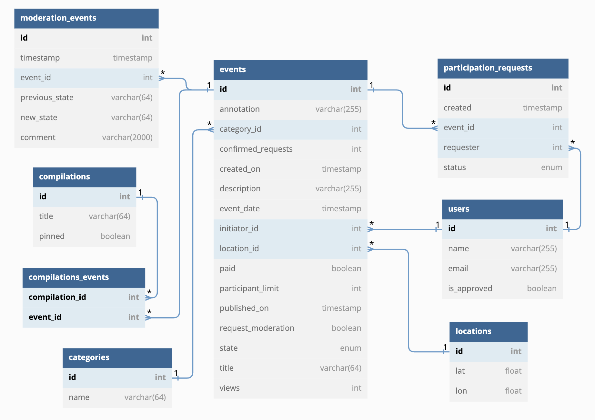

# Сервис Explore with me
Свободное время — ценный ресурс. Ежедневно мы планируем, как его потратить — куда и с кем сходить. Сложнее всего в таком планировании поиск информации и переговоры. Нужно учесть много деталей: какие намечаются мероприятия, свободны ли в этот момент друзья, как всех пригласить и где собраться.

Схема сервиса:
